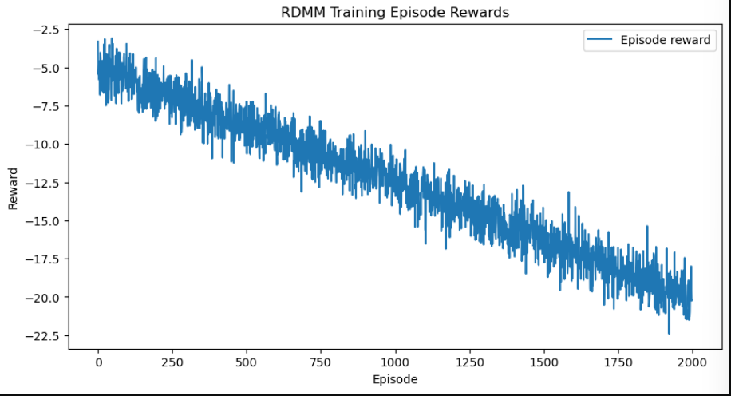

# A Deep Reinforcement Learning Framework for Algorithmic Trading in FX Market

### A PyTorch Implementation of Cartea, Jaimungal, and Sánchez-Betancourt (2021)


## Overview

This repository provides a high-fidelity PyTorch implementation of the deep reinforcement learning (DRL) framework for algorithmic trading presented in the seminal paper "Deep Reinforcement Learning for Algorithmic Trading" by Álvaro Cartea, Sebastian Jaimungal, and Leandro Sánchez-Betancourt. The primary objective of this project is to devise, train, and rigorously evaluate optimal statistical arbitrage strategies within the complex and dynamic environment of foreign exchange (FX) markets.   

The core methodology leverages DRL agents to trade an "FX triplet"—a portfolio of three currency pairs whose exchange rates are intrinsically linked by a no-arbitrage condition in the long run. The trading opportunity, therefore, does not arise from predicting absolute price movements but from identifying and exploiting transient deviations from this theoretical equilibrium. These deviations are modeled using a co-integrated stochastic process, providing a mathematically sound basis for a mean-reversion strategy. A significant departure from many contemporary approaches, this framework trains the learning agents within a simulated market environment governed by this known stochastic process. This allows for the generation of vast amounts of training data, ensuring robust policy optimization that is not overfitted to the idiosyncrasies of a limited historical dataset.   

The implementation focuses on two key DRL algorithms that are well-suited for this financial application: the Double Deep Q-Network (DDQN) and a novel variant of Reinforced Deep Markov Models (RDMMs). These agents are tasked with learning an optimal policy that maps observable market states—such as current exchange rates and the agent's inventory—to a sequence of discrete trading actions. The ultimate goal is to maximize a cumulative reward function over a finite trading horizon, effectively learning a sophisticated statistical arbitrage strategy from first principles.   

This project's design reflects a crucial strategic shift in the application of reinforcement learning to quantitative finance. The direct application of RL to raw, noisy financial data is fraught with significant challenges, including high signal-to-noise ratios, non-stationary market dynamics, and the severe sample inefficiency of many RL algorithms. Such "end-to-end" models often struggle to generalize and are prone to discovering spurious correlations. In contrast, traditional quantitative finance has long relied on the power of stochastic models—such as jump-diffusion processes or co-integration models—to provide a structured and interpretable description of market dynamics. While these models offer a robust foundation, deriving optimal trading strategies from them using classical stochastic optimal control (SOC) techniques can be mathematically intractable, especially when dealing with complex, path-dependent objectives and constraints.   

The methodology presented by Cartea et al. offers a powerful synthesis of these two paradigms. It leverages a classical, well-understood financial model (co-integration) to generate a realistic and controllable simulation environment. This approach elegantly bypasses the data limitation problem, as the agent can be trained on a virtually infinite stream of simulated market scenarios, allowing it to explore the state-action space far more comprehensively than would be possible with historical data alone. Consequently, this reframes the role of reinforcement learning in finance. It is not employed as a black-box function approximator attempting to "beat the market" from raw price series. Instead, it serves as a highly efficient and powerful numerical    

solver for complex, path-dependent optimal control problems within a well-specified and financially plausible model of the world. This "model-based simulation" approach makes the resulting strategies more interpretable and robust, as the agent's performance can be directly attributed to its learned ability to exploit the specific dynamics of the co-integrated model. This represents a significant maturation of the field, moving from speculative applications toward rigorous, model-informed problem-solving.

> **Deep Reinforcment Learning for Algorithmic Trading**
> Cartea, Á., Jaimungal, S., and Sánchez-Betancourt, L. (2021) — [doi.org:ssrn.3812473](https://doi.org/10.2139/ssrn.3812473)

---

## Theoretical Foundations

This section provides the essential theoretical background from both mathematical finance and reinforcement learning necessary to fully comprehend the project's architecture and objectives.

### The Financial Problem: Statistical Arbitrage in FX Triplets

The financial problem at the heart of this project is the execution of a statistical arbitrage strategy on a set of correlated assets. The chosen universe is an FX triplet, which provides a natural and economically grounded basis for such a strategy.

An `FX triplet` is composed of three distinct currency pairs where one of the exchange rates is theoretically redundant. For instance, consider the triplet consisting of `EUR/USD`, `GBP/USD`, and `EUR/GBP`. The principle of no-arbitrage dictates that, in an efficient market, the cross-rate EUR/GBP must be equal to the ratio of the other two rates: `EUR/GBP=EUR/USD/GBP/USD`. This identity establishes a deterministic, long-run equilibrium relationship that should hold to prevent risk-free profits.   

However, in real-world electronic markets, various microstructure effects—such as order flow imbalances, differential liquidity across pairs, and latency—can cause temporary deviations from this theoretical equilibrium. The paper models this dynamic by assuming that the logarithms of the exchange rates follow a co-integrated stochastic process. Co-integration is a statistical property of time-series variables indicating that a linear combination of them is stationary, even if the individual series are not. This mathematical framework perfectly captures the essence of the statistical arbitrage opportunity: the existence of a stationary, mean-reverting relationship among the non-stationary exchange rates. The agent's goal is to systematically profit from the predictable reversion of the triplet relationship back to its long-run equilibrium.   

The agent's task is formulated as an optimal control problem. It must actively manage its inventory (i.e., its long or short positions) in each of the three currencies over a fixed time horizon, denoted by T. By executing a sequence of trades, the agent aims to maximize a predefined performance criterion, which is typically a function of the final portfolio value, often incorporating a penalty for risk (e.g., inventory penalties). This setup distinguishes the problem from simpler, myopic trading rules. The agent must learn a dynamic strategy that accounts for the future impact of its current trades on its inventory and the evolving market state, a hallmark of sequential decision-making problems that are ideally suited for a reinforcement learning solution.

---

## The Reinforcement Learning Framework

To solve this optimal control problem, the trading task is formally structured as a Markov Decision Process (MDP). The MDP provides the mathematical foundation for reinforcement learning, which, as defined by Sutton, is a computational approach to "learning what to do–how to map situations to actions–so as to maximise a numerical reward signal".

---

## MDP Formulation

The MDP for this problem is defined by the following components:

- **State Space (S):** The state is a vector, `st`, that provides a complete description of the environment at `each time step t`. To make an optimal decision, the agent requires all relevant information to be encapsulated in the state. For this problem, the state vector must include:

    - The current exchange rates of the three currency pairs in the FX triplet.
    - The agent's current inventory in each of the three currencies, which represents its exposure to market movements.
    - The time remaining until the end of the trading horizon, `T−t`. This component is critical, as the optimal trading strategy is inherently path-  dependent and will change dramatically as the agent approaches the terminal time (e.g., the need to liquidate its final position to realize profits becomes more urgent).

- **Action Space (A):** The action space defines the set of all possible trades the agent can execute at any given time step. For tractability and compatibility with Q-learning methods, this implementation utilizes a discrete action space. At each step, the agent can choose from a predefined set of actions, such as buying, selling, or holding a fixed quantity of each of the tradable currency pairs.

- **Reward Function (R):** The reward, `rt`, is the numerical feedback signal the agent receives from the environment after taking an action at in state st. The design of the reward function is crucial for aligning the agent's learning process with the overall financial objective. A common and effective formulation is the change in the marked-to-market value of the agent's portfolio from time `t` to `t+1`. More sophisticated reward functions could also incorporate penalties for holding large inventories (to encourage risk aversion) or explicit deductions for transaction costs.

- **Policy (π):** The agent's learned strategy is its policy, denoted as π(a∣s), which represents a mapping from states to actions. The central goal of any reinforcement learning algorithm is to discover the optimal policy, π^*, which maximizes the expected cumulative discounted reward over the trading horizon.

---

## Algorithms Implemented

This repository implements two powerful deep reinforcement learning algorithms to find the optimal policy π^∗

- **Double Deep Q-Networks (DDQN):**<br>
Standard Deep Q-Networks (DQN) revolutionized the field by using a deep neural network to approximate the optimal action-value function, `Q 
∗
 (s,a)`. However, the original DQN algorithm is known to suffer from a significant issue: the systematic overestimation of Q-values. This occurs because the same network is used to both select the best action for the next state and to evaluate the value of that action, creating a positive feedback loop that can lead to suboptimal policies and unstable training. This problem is particularly acute in highly stochastic environments like financial markets.<br>
 
    The DDQN algorithm, as referenced in the literature, provides an elegant solution to this problem by decoupling the action selection from the
action evaluation. It maintains two separate neural networks: a primary (or online) network for selecting the best action for the next state, and a target network for evaluating the Q-value of that selected action. This simple but powerful modification breaks the maximization bias, resulting in more stable learning dynamics and ultimately superior final policies. The choice of DDQN over standard DQN is therefore not an arbitrary upgrade but a deliberate and methodologically sound decision to handle the inherent stochasticity and noise of financial markets.   

    The max operator in the standard DQN target calculation, `Target=R+γ⋅max a′​Q(s′, a′)`, has a tendency to pick out actions corresponding to positively overestimated Q-values in a noisy environment. This leads to a consistent upward bias in the training targets. DDQN mitigates this by using the online network to select the action `(argmaxa′Qonline(s′,a′))` and the target network to evaluate its value `(Qtarget(s′,argmaxa′Qonline(s′, a′)))`. Since the estimation errors in the two networks are less likely to be correlated, this decoupling significantly reduces overestimation bias. This demonstrates a mature understanding of DRL's practical limitations and underscores that successful application in finance requires selecting algorithmic variants specifically designed to counteract the known failure modes that are exacerbated by the target domain's characteristics.

- **Reinforced Deep Markov Models (RDMMs):**<br>
    The source material refers to the use of a `new variant of reinforced deep Markov models (RDMMs)`. While the precise architecture is proprietary to the original research, the name suggests a model that integrates the function approximation power of deep learning with the explicit modeling of state transitions and latent variables, which is characteristic of Hidden Markov Models (HMMs) or other state-space models.   

    Our implementation interprets this concept as an architecture that incorporates recurrent components, such as a `Long Short-Term Memory (LSTM)` or `Gated Recurrent Unit (GRU)` layer, within the Q-network. This allows the agent to not only learn the immediate Q-value of a state-action pair but also to develop a more nuanced internal representation of the market's temporal dynamics and latent state evolution. Such an approach is well-suited to capturing the path-dependent and mean-reverting nature of the co-integrated process that drives the simulation.

---

## Implementation Architecture

**This section provides a detailed overview of the codebase structure, connecting the theoretical concepts discussed above to their concrete implementation in Python and the PyTorch framework. The architecture is designed to be modular, configurable, and extensible.**

`environment.py`: ### The Simulated Market**
This module is the heart of the simulation, containing the `XTripletEnvironment` class. This class is responsible for creating a realistic market environment in which the DRL agent can be trained and evaluated.

- It implements the co-integrated stochastic process that governs the evolution of the FX triplet's exchange rates. A Vector Error Correction Model (VECM) is a suitable choice for generating realistic, path-dependent price series that exhibit the desired mean-reverting properties.
- It manages the agent's state at each time step, including its current inventory holdings and the prevailing market prices.
- It exposes a standard OpenAI Gym-like interface, with a primary `step(action)` method. This method takes an action from the agent as input, advances the market simulation to the next time step, calculates the corresponding reward based on the change in portfolio value, and returns the new state, the reward, and a flag indicating the end of the episode.

`agent.py`: ### The DRL Trading Agent**

**This module contains the logic for the learning agents, including the `DDQNAgent` class and potentially an `RDMMAgent` class.**

- **Neural Network:** It defines the Q-network architecture using the `torch.nn` module. The network is typically a Multi-Layer Perceptron (MLP) that takes the flattened state vector as input and outputs a vector of Q-values, one for each possible discrete action. For the RDMM, this architecture would be augmented with recurrent layers.
- **Replay Buffer:** It implements an experience replay buffer, a critical component for stabilizing the training of off-policy DRL algorithms like DDQN. The buffer stores past transitions (tuples of `(state, action, reward, next_state)`) and allows the agent to sample random mini-batches from this memory to train the network. This practice breaks the temporal correlations inherent in sequential data, leading to more stable and efficient learning.
- **Learning Logic:** It contains the core `learn()` method, which implements the DDQN update rule. This involves sampling a mini-batch from the replay buffer, calculating the target Q-values using the decoupled selection-evaluation mechanism, computing the loss (typically Mean Squared Error) between the predicted and target Q-values, and performing backpropagation to update the weights of the primary network.

---

Repository Structure

**The project is organized into a clean and logical directory structure to facilitate ease of use and future development.**
```
├── data/                  # Directory for saving results, plots, and training logs
├── models/                # Directory for saving trained model weights
├── envs/
|   ├── fx_triplet_env.py
|   ├── __init__.py
├── notebooks
|   ├── ddqn_baseline.ipynb
|   ├── gym_env_ddqn_merged.ipynb
|   ├── RDMM_agent.ipynb
|   ├── ddqn_checkpoints/
|   ├── ddqn_checkpoints_paper/
|   ├── ddqn_logs/
|   ├── ddqn_logs_paper/
|   ├── rdmm_checkpoints/
|   ├── rdmm_logs/
├── images/
|   ├── episode_reward.png
|   ├── EUR_GBP_Inventories.png
|   ├── Inventory_trajectories.png
|   ├── PnL_distribution.png
|   ├── policy_return_distribution.png
|   ├── RDMM_rewards.png
|   ├── reward_distribution.png
|   ├── Train_loss_episode_rewards.png
├── src/
│   ├── ddqn_baseline.py           # Contains the DRL agent classes (DDQN)
│   ├── fx_triplet_env.py          # The simulated FX triplet market environment
│   ├── gym_env_ddqn_merged.py     # Combined class
│   ├── RDMM_agent.py              # Contains the DRL agent classes (RDMM)
│   └── setup.py                   # setup function
|
├── requirements.txt       # List of Python dependencies for easy installation
└── README.md              # This documentation file
```
---

## Getting Started

Follow these instructions to set up the project environment and install the necessary dependencies.

### Prerequisites
Ensure you have the following software installed on your system:

- Python 3.8 or higher
- PyTorch 1.10 or higher
- NumPy
- Pandas
- Matplotlib
- PyYAML (for parsing the configuration file)

### Installation

1. Clone the repository to your local machine:
```
git clone https://github.com/your-username/drl-fx-arbitrage.git
cd drl-fx-arbitrage
```

2. It is highly recommended to use a virtual environment to manage project dependencies and avoid conflicts. Create and activate a new virtual environment:
```
python -m venv venv
source venv/bin/activate  # On Windows, use `venv\Scripts\activate`
```

3. Install all the required Python packages using pip and the `requirements.txt` file:
```
pip install -r requirements.txt
```
---

## Usage

All experimental parameters, including agent hyperparameters and environment settings, are managed centrally through the `config.yaml` file. This design allows for rapid and organized experimentation without needing to modify the underlying source code.

### Training the Agent
To begin a new training session for a DRL agent, execute the `main.py` script from the root of the project directory with the `train` mode flag.
```
python main.py --mode train
```
The script will automatically load the configuration from `config.yaml`, initialize the market environment and the DRL agent, and commence the training loop. During training, progress metrics such as the cumulative reward per episode and the Q-loss will be logged to the console and saved to files in the `data/` directory. Upon completion, the trained model weights will be saved in the `models/` directory for later evaluation.

Key hyperparameters that can be adjusted in `config.yaml` include:

- `learning_rate`: The learning rate for the Adam optimizer used to train the neural network.
- `gamma`: The discount factor, γ, which determines the present value of future rewards.
- `epsilon_start, epsilon_end, epsilon_decay`: Parameters governing the ϵ-greedy exploration strategy, which balances exploration and exploitation during training.
- `buffer_size`: The maximum number of transitions to store in the experience replay buffer.
- `batch_size`: The size of the mini-batch sampled from the replay buffer for each training step.
- `num_episodes`: The total number of episodes (trading horizons) to train the agent for.

---

## Graphical Results

The plots illustrate a representative sample of the cumulative P&L trajectory, episode rewards, PnL inventories, Inventory trajectories, and EUR & GBP Trajectories for the DDQN agent versus the baseline strategy over a single evaluation episode. The graph clearly shows the agent's ability to generate consistent, steady profits by actively trading the mean-reverting spread, whereas the naive baseline strategy struggles to perform, highlighting the superiority of the learned policy.





---

## Citation

If you use this code, the underlying methodology, or the analysis presented in this repository for your research, please ensure you cite the original paper by Cartea, Jaimungal, and Sánchez-Betancourt.

For LaTeX users, the following BibTeX entry can be used:

```
@article{Cartea2021DeepRL,
  title={Deep Reinforcement Learning for Algorith-mic Trading},
  author={Álvaro Cartea and Sebastian Jaimungal and Leandro Sánchez-Betancourt},
  journal={SSRN Electronic Journal},
  year={2021},
  doi={10.2139/ssrn.3812473}
}
```


